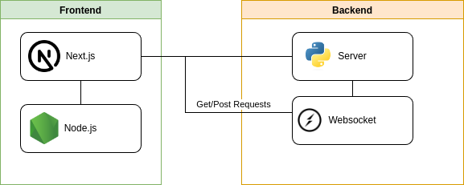

# Accessible Tic-Tac-Toe with Real-Time Gameplay

This project offers a fun and accessible Tic-Tac-Toe experience designed specifically for people with visual impairments. Built with Next.js for the frontend and FastAPI for the backend, it utilizes WebSockets for real-time communication during gameplay.

## 1. Installation and Setup

### 1.1 With Docker (Recommended)

#### Requirements

- Docker

#### Steps

1. Run `docker-compose up --build` in the root directory of the project
2. Navigate to `http://localhost:3000` in your browser
3. In another browser window, navigate to `http://localhost:3000` and start playing!

### 1.2 Without Docker

#### Requirements

- Node.js version 20 or later
- Python version 3.11 or later

#### Steps

1. Run `npm install` in the `frontend` directory
2. Run `npm run dev` in the `frontend` directory
3. Create a virtual environment with `python -m venv <path to virtual environment>` [optional]
4. Change to the `server` directory
5. Run `pip install -r requirements.txt`
6. Run `./run-dev.sh` to start the backend
7. Navigate to `http://localhost:3000` in your browser
8. In another browser window, navigate to `http://localhost:3000` and start playing!

## 2. Accessibility Features

[Demo Video](https://youtu.be/aiTg9beDqyA)

1. All game elements are fully accessible and navigable using the keyboard.
2. High contrast colors for improved visibility, verified with the [Contrast Checker](https://webaim.org/resources/contrastchecker/).
3. An announcer provides in-game audio cues to keep you informed about the board state, whose turn it is, and game outcomes. This allows you to follow along without needing to visually track the game board.

## 3. Architecture Diagram

### 3.1 Frontend

- Handles user interaction, renders the game board, and communicates with the backend via WebSockets.
- Styling is done with Tailwind CSS and [react-aria-commponents library](https://react-spectrum.adobe.com/react-aria/index.html).

### 3.2 Backend

- Processes game logic, manages game state, and relays information between players using WebSockets.
- Backend is built with FastAPI and uses WebSocket.io

#### 3.2.1 Websocket Communication

Websocket was chose to allow for real-time communication between the server and the client. The following events are handled by the server:

| Event                | Description                                                           |
| -------------------- | --------------------------------------------------------------------- |
| join_game            | handles the creation of game and joining                              |
| in_game              | allow users to enter a socket room for communication                  |
| waiting_for_opponent | server emits to frontend to signal that player has to wait            |
| handle_move          | frontend sends the information to the server on move played           |
| game_update          | server sends to client game status, move played, next_turn (optional) |

## 4. Assummptions

This project currently operates under the following assumptions:

1. Users can play anonymously without needing to create an account.
2. The focus is on real-time gameplay; past game history is not stored.
3. Users enter the correct game ID to join an existing game.

## 5. Future Improvement

1. Adding view game history functionality.
2. Adding login functionality.
3. Adding play again functionality.
4. Deploying the application to a cloud provider like AWS.
5. Refactoring the frontend and use server side rendering to improve performance.
6. Conducting usability testing with users with visual impairments to gather feedback and improve the application.

## 6. Closing Thoughts

When designing appliaction it is important to design with the users in mind. We cannot based out assumptions on the requirements of users, but it is important to gather feedback from users. Often times, we do not design for accessibility as it is often overlooked, but it is vital to inclusive design.

> "Design for one, extend to many" - Microsoft

By considering diverse accessibility needs, we can ensure no user is left behind. Designing for those with visual impairments can also benefit others, such as users driving or in bright environments.

## 7. References

- [Contrast Checker](https://webaim.org/resources/contrastchecker/)

- [Web Content Accessibility Guidelines (WCAG) 2.1](https://www.w3.org/TR/WCAG21/)
- [Accessibility inspiration](https://savvasstephanides.hashnode.dev/lets-create-an-accessible-tic-tac-toe-game)
- [Microsoft Inclusive Design](https://www.microsoft.com/design/inclusive/)
